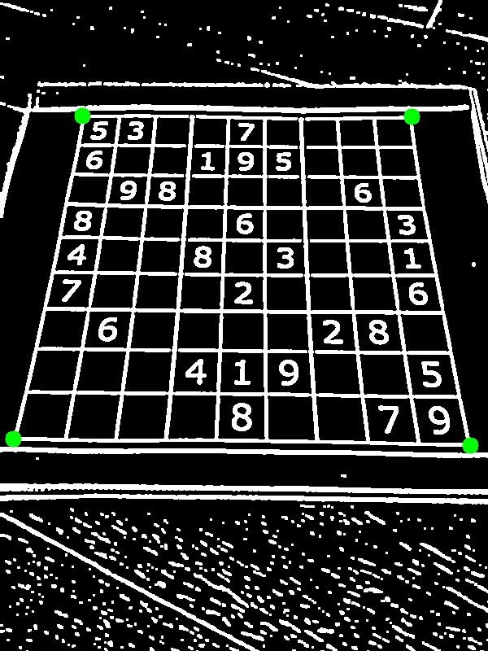
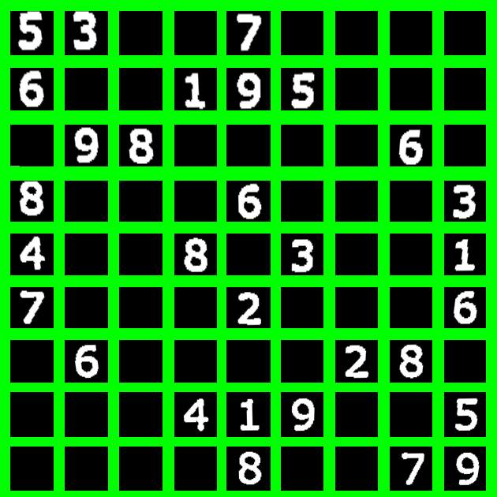
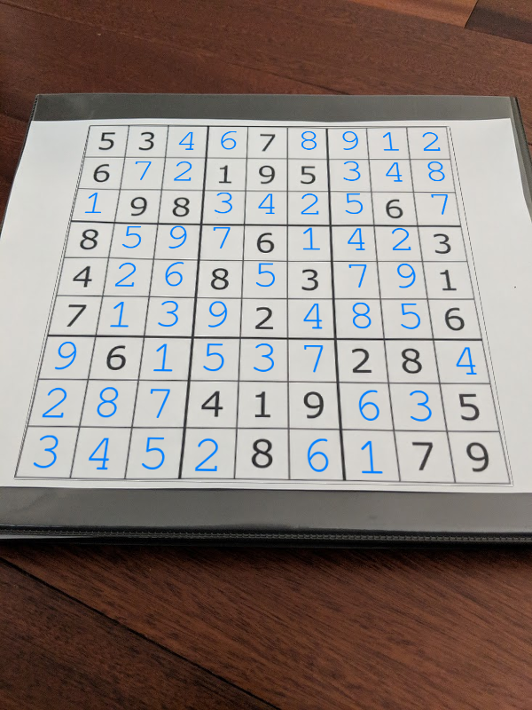
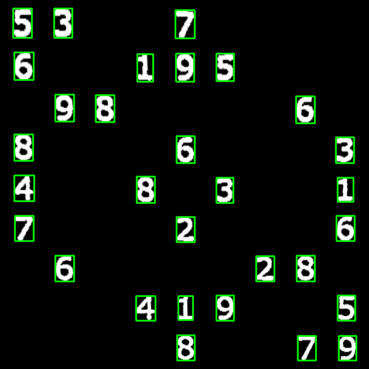
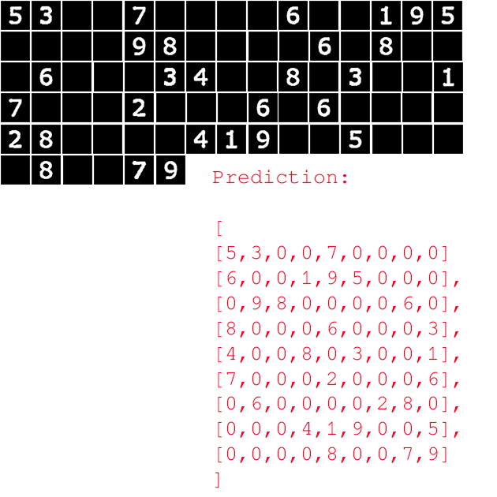
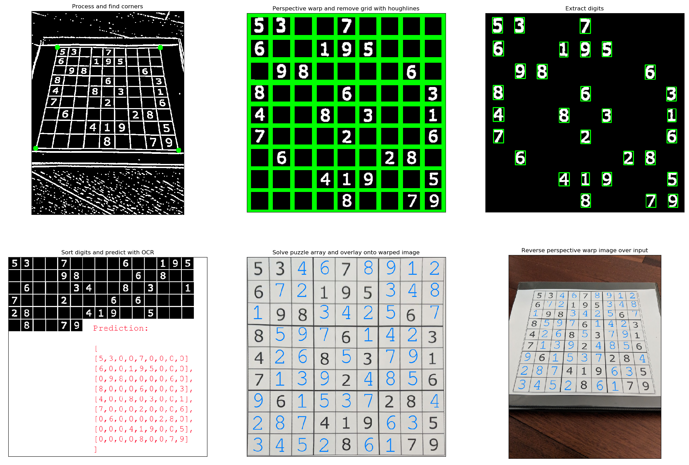

# Sudoku-Solver

## ABSTRACT

In this paper we propose a method of detecting and 
recognizing a Sudoku Puzzle and providing a digital copy of the 
solution for it. After applying appropriate pre-processing to the 
acquired image we use efficient corner extraction techniques to 
recognize the grid. Template matching is used as a method for 
digit recognition. The algorithm can handle cases of translation, 
perspective, illumination gradient, scaling, background clutter
and severe rotation.
Keywords- connected component; homography; affine 
transformation; template matching.

## INTRODUCTION
In real life we come across Sudoku puzzles of varying 
difficulty levels in newspapers and other text and digital media. 
It is a common leisure activity for a lot of people. However, it 
is observed that the solution is not always immediately 
available for the users’ verification. In most cases, people have 
to wait till the next day to check the solutions of the Sudoku 
they just solved. Hence our motivation for this project was to 
develop an application on an android device for this purpose. 
In our application, the user needs to capture a clean image of an 
unsolved Sudoku Puzzle, which then returns the complete 
solution of the same.

## ALGORITHM
Our algorithm is designed specifically to solve a Sudoku 
puzzle containing a 9x9 grid of numbers. The main task of the 
algorithm is divided into two sections: Firstly, it should 
accurately locate the grid position in the image while taking 
care of problems of background clutter, scaling, translation, 
rotation and perspective skew. The second part of the 
algorithm must then locate those positions in the grid where 
there are numbers and recognize them with precision. A 
recursive backtracking algorithm will then solve the puzzle.
Section (I) discusses in detail the measures taken to extract 
the grid from the image and section IV discusses the digit 
recognition sub-system of our algorithm which also takes care 
of severe rotation we might be faced with. Section (II) then 
briefly discusses the algorithm used to solve the Sudoku 
puzzle and provides a brief overview of how the system was 
integrated with the Android device.

## I EXTRACTING THE PUZZLE GRID
Once we have acquired an image, 
containing the Sudoku grid we first convert it to a grayscale 
image, which is then the input to other preprocessing techniques so that the grid can be accurately 
located.
### A. Smoothing the image and Adaptive thresholding:
The input image is first filtered with a low-pass Gaussian 
filter of 5x5 window size. The reason for this is that it 
smoothens out sharp projections and other high frequency 
components in the image. Also it helps in getting better results 
subsequently. It takes care of any jagged edge clutter that ppears after adaptive thresholding, thereby resulting in robust 
grid corner extraction. It was also observed that performing 
adaptive thresholding on the image without the smoothing filter 
gave broken digits. After blurring, the digits obtained were 
clean and complete, which could be used for digit recognition. 
Once smoothed, the image is passed through an Adaptive 
thresholding algorithm. The reasoning behind this is that there 
may be an illumination gradient (for example, due to shadows 
of the human capturing the images with the mobile phone), 
across the image and global thresholding will completely 
obliterate the details of the grid and digits making it impossible 
to extract it. Applying window-wise thresholding helps in 
localizing the effect thus effectively bringing out the details 
which are perfect for our algorithm. The window size used by 
us for Adaptive thresholding was heuristically chosen to be 30 
percent of the approximate size of each 1x1 block in the 
approximate 9x9 grid of the puzzle. This is because applying 
thresholding in this manner over the entire grid helps in getting 
finer details in the numbers thereby making our algorithm for 
recognizing the digits more robust.

### B. Isolating the grid from background clutter of the image:
An important part of the algorithm is to correctly identify 
the location of the Sudoku Grid in the given image. To achieve 
this, we rely on the concept of Connected Components. The 
grid by itself is a connected component and our hypothesis is 
that it is the largest connected component in the image 
subjected to certain constraints. These constraints were 
introduced after identifying some shortcomings in our previous 
approach. The hypothesis that the Sudoku grid is the largest 
connected component is correct in most cases but failed in 
some. These cases were where the image was characterized 
with the presence of blobs outside the Sudoku grid that had 
very high pixel density. In such cases, although the grid is one 
of the largest connected components, it might not be the largest 
one. To overcome this problem, while performing flood-filling 
algorithm, a technique to identify all connected components 
using 4 connectivity in the image, we keep track of the largest connected component, i.e. the one with the maximum pixel 
density. This Connected component has to fulfill certain other 
constraints. These constraints are in direct correlation to our 
requirement that the Sudoku Grid has a height and width of at 
least 30% of that of the entire image height and width
respectively. This constraint gave very good results practically 
and helped rule out unwanted clutter which had the potential of 
being misidentified as the grid component. To make our 
constraints closer to identifying the actual grid, we impose 
another restriction. The corners of the connected component 
discovered should have its corner points present in the image, 
in addition to that fact that they should not overlap ith the 
edges of the image.

This approach, gave very good results in terms of grid 
detection. It removes any clutter outside the grid and isolates 
the Sudoku grid accurately and eases the rest of our algorithm.

### C. Extracting the grid corners:
The next step in our algorithm is identifying the four 
corners of the grid to determine a perspective transformation 
from the given grid to a specified square grid. Prior to 
identifying the corner locations, we erode the image with a 
square structuring element of window size 5X5. A lot of 
Sudoku puzzles have an outer grid boundary which is very 
thick. The algorithm implemented to locate the corners of the 
grid relies on accurate pixel locations. To aid this algorithm, 
we perform an erosion to make the grid boundaries thinner 
resulting in the detection of the corners to be in more 
concentrated location. Erosion will also eradicate the thin grid 
lines inside the extracted grid component and make the 
algorithm execute faster in most cases.
The strategy to locate the corner points involved first 
identifying the minimum distance and the maximum distance 
points with respect to the origin of the image and using these to 
judge the location for the top right and bottom left corner 
points. The origin for the image co-ordinate system is located 
at the top left corner of the image. The minimum distance and maximum distance points in most cases would be the top left 
and bottom right corner points of the grid.

Thus, traversing the image with only the grid details in it, 
we accurately identify the minimum distance and the maximum 
distance points on the Sudoku grid. 
To identify the top right and bottom left corner points, we 
employ a different strategy. We exploit the rectangular regular 
symmetry of the grid to do so. Identifying that the top right 
corner point would lie above the diagonal formed with the 
maximum and minimum distance points, and the bottom left 
corner point would lie below the same diagonal, helps us 
isolate these other two corner points. The sum of the distances 
of the top right corner from the top left and bottom right corner 
would be the largest distance achievable for a point on the grid 
lying above the aforementioned diagonal. On similar lines, the 
bottom left corner would be the point with the largest sum of 
distances from the maximum and minimum distance points 
located below the diagonal. Doing so, we successfully identify 
the location of other two corners of the grid.
But under certain angle of rotations of the grid, for example 
a 45 degree anticlockwise rotation as shown in figure-5, the 
minimum distance point might not be correctly identified. In 
this case, the minimum distance point is detected to be at the 
edge and not at the corner as depicted by the red circle on the 
edge. But the other two corner points at the top right and 
bottom left corner still have maximum sum of distance from 
these two detected points, even if the minimum distance point 
is not a corner as in figure-5. For identifying the correct 
location of the minimum distance corner point, we repeat the 
same algorithm using the top right and the bottom left corner 
points. We locate the diagonal passing through the identified 
other two corner points. We apply the same distance heuristic 
as illustrated in the previous paragraph, and re-locate the 
minimum distance and maximum distance points as 
highlighted by red(at the corner) and green circles respectively. 
At the end of this, we thus have successfully managed to 
identify the four corner points of the grid.

### D. Taking care of perspective in the image:
Once we have extracted the corner points in the image we 
calculate the side lengths for the grid from these points and
choose the maximum side length to be the one used for the next 
homographic transformation to a perfectly square Sudoku 
grid. The above identified four corner points are correlated to 
the corners of the perfectly square Sudoku grid. These 
correspondences among the four corner points are then used to 
obtain a 3x3 projection matrix. Applying this matrix to perform 
the homographic transformation gives us a perfectly square
Sudoku grid.

## II. RECOGNIZING THE DIGITS AND HANDLING ROTATION
Now that we obtained the transformed square without the 
perspective, our next task is to locate the digit positions in the 
puzzle grid and recognize them. For this we use template 
matching[3] method. We used a template image containing six 
different font types of digits 1-9 as shown in figure-7 below.
This part of the algorithm takes care of all kinds of rotation 
including a completely inverted image as well.The steps taken 
for this are described below:

### A. Preprocessing the Square Grid:
On extracting only the square grid of the Sudoku, we need 
to perform some preprocessing steps to extract only the digits 
from it. For this we perform similar preprocessing steps as in 
Section III. We perform adaptive thresholding, as shown in 
figure-8, followed by connected component retrieval through 
which we identify the grid and eliminate it, as shown in 
figure-9. This gives us an image containing only the numbers.
Now, one point to note here is that since we allow severe rotation, this square grid of numbers may have a rotation of 
+90, 180 and -90 degrees. That needs to be attended to in next 
few steps of recognition. A closing operation is then 
performed to remove any small components or blobs which 
may hinder the digit recognition.

### B. Scaling the template image:
It is a fact that the length of the Sudoku grid will be 
different in different images while our template image used for 
recognition is of fixed size. So, the scale of the digits in 
Sudoku and that in the template is different and needs to be 
matched before template matching[3] is performed to get the 
best results. For this we go through the obtained digit grid and 
stop when we find at least one digit using the flood-filling 
algorithm. Here again we apply heuristics based on the height 
and width of the bounding box of the connected component to 
ensure that we don’t identify noise clutter as a digit. Basically, 
we assume that the height of the digit will be at least 1/3rd the 
size of a 1x1 block in the 9x9 square grid and also that it 
cannot exceed the 1x1 block size. Similar heuristics are also 
applied to the width with only the change that more tolerance 
is allowed here since in case of digit ‘1’ the width is 
comparatively smaller. These heuristics are again applied later 
while actually recognizing the digits.
Once we have obtained one digit each from the template 
image and the Sudoku image, we can easily obtain the height 
of the digit, from the bounding box dimensions. What we need 
to now find is the scale factor that should be applied to the 
template image of digits so that the size of a template digit and 
that of a Sudoku digit is the same. For this we use the fact that 
the height of all the digits is always the same although the 
width might be different. Also we know that the aspect ratio of 
the digit in the template image is same as that in the given 
Sudoku image. So all we need to do is take the ratio of the 
heights of the digits obtained from the two images and apply
this scale to the digits template image. The height of the digits 
will now be same in template and the Sudoku image and also
the width will automatically be scaled by the same ratio and 
give the right dimensions.

### C. Taking care of rotation:
As noted earlier we could be having a rotation of +/- 90 or 
180 degrees in our Sudoku square. A rotation of +/-90 degrees 
can be easily taken care of. The problem is when the image is 
completely inverted.
To take of a rotation of +/-90 degrees all we need to check 
is whether for any digit the height of the bounding box of the 
extracted digit is smaller than that of the width. This is 
because we know for certain that the height of any digit in any 
font is always greater than its width. So, in step B itself if we 
find that this condition is satisfied then we simply rotate the 
image clockwise by 90 degrees not considering whether the 
actual rotation needed was +/- 90 degrees. So now after this 
rotation we know for certain that our final Sudoku image with 
numbers is either upright or completely inverted. Since there 
is no way to actually be sure of that, what we do is we used this image now and match it across two templates and take the 
best result. One of the templates is the scaled and upright 
original template of the digits, while the 
other template will be an inverted version of the scaled 
template. Now using these templates and the Sudoku image 
with 0 or 180 degrees rotation we perform recognition results.

### D.Template Matching:
Once again we now perform connected component 
analysis while also applying the heuristics mentioned earlier to 
ensure that we don’t capture any clutter to extract the digits. 
Since the image is a perfect square containing only the Sudoku 
grid we can easily identify the location of the block of the 
number in the 9x9 grid. Then we perform template 
matching[3] as shown in figure-10(for digit ‘7’), using the two 
templates created earlier. We find which digit gives the 
maximum response in each of the templates and keep track of 
these in two separate Sudoku matrices. The blank locations in 
the Sudoku grid are put to zero as required by the backtracking 
algorithm. We also keep track of number of digits for which 
each of the templates, the upright one and the inverted one, 
gives the maximum response. Based on whichever gives the 
maximum number of best responses of template matching[3]
once all the digits in Sudoku puzzle have been recognized, we 
use the Sudoku matrix corresponding to that template image as 
our final recognized Sudoku.
Performing this is actually exhaustive but, the reason we
perform template matching[3] on entire Sudoku image using 2 
templates is that we do not know in advance what numbers the 
Sudoku grid might contain and also whether it is upright or 
not. The fact that the digits like 1, 6, 8 and 9 have 180 degrees 
symmetry makes it tough to make a decision and since it is 
quite possible that we might not encounter other digits very 
often in the Sudoku grid.
So now once we have the final recognized 9x9 matrix of the 
Sudoku we just give it as an input to the part of the algorithm 
that actually solves the puzzle and gives the image of the solution as the output.

## III. SOLVING THE SUDOKU
### Recursive Backtracking
The algorithm to solve the Sudoku is based on a recursive 
backtracking strategy. We store the numbers obtained from the 
grid in the image, in a two dimensional array with the number 
0 assigned to blank grid locations. To get a solution for the 
grid, we identify a blank location in the grid. Based on Sudoku 
rules, we identify a valid assignment by iterating through the 
numbers 1-9. We then try to recursively solve the grid with this 
new number placement. If there are no more grid locations 
which need to be filled, it is an indication that the grid is 
solved, and we return the solved grid back to the main 
algorithm. On the other hand, if we fail to recursively find a 
solution for a grid, we backtrack and try a different number 
assignment for a location and try solving the grid again. If all 
combinations of number assignments are depleted without 
finding a solution, we conclude the grid is unsolvable. For our 
purposes however, we assume that the image taken by the user 
is a valid Sudoku puzzle and our algorithm will always solve 
it irrespective of the difficulty level of the puzzle.

### IV. RESULTS AND CONCLUSIONS
We present a Smart Sudoku Solver that can solve 
unsolved Sudoku images with small amount of perspective. 
Also illumination changes across the images are taken care 
of. The algorithm can also give solution in cases of severe 
rotation such as when the Sudoku Puzzle is completely 
inverted. Since the scale of the image also varies from 
image to image, our algorithm efficiently manages these 
problems.
Since there doesn’t exist any standard Sudoku image 
dataset to test on, we created our own dataset of 100 test 
images and produced results on them. Since there are no 
standard images to compare to, it is difficult to quantify and 
compare results. However in general, for the few testing 
images we extracted from the web, we found our algorithm 
to be 100% robust to full rotation, 100% robust to 
translation a perspective skew of +- 45 degrees and robust 
to scale as long as the edge length of the Sudoku is at least 
30% of the original image dimensions and robust to 6 most 
commonly found in modern Sudoku images that give robust 
results for template matching 

